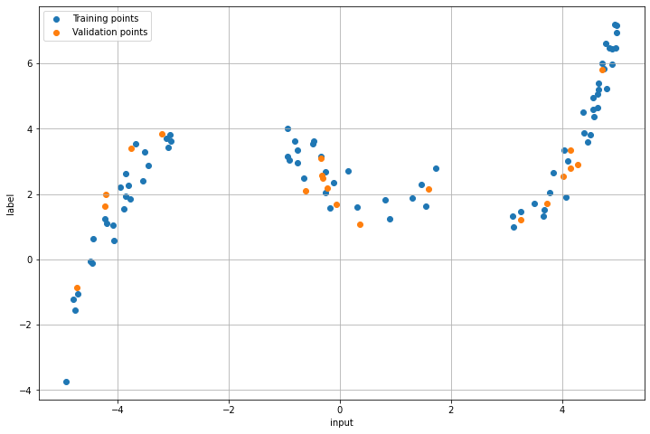
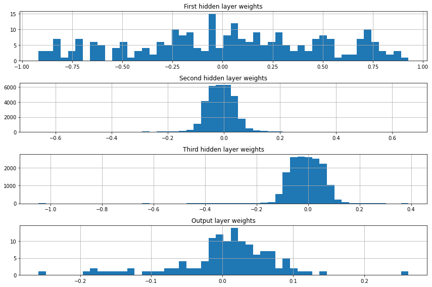
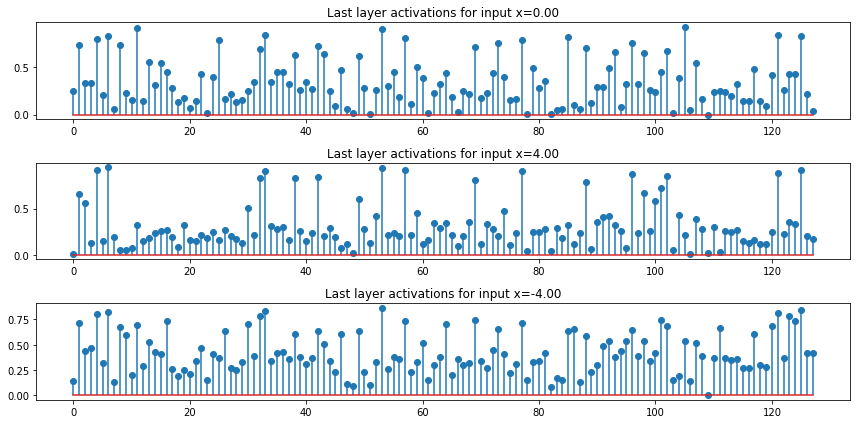
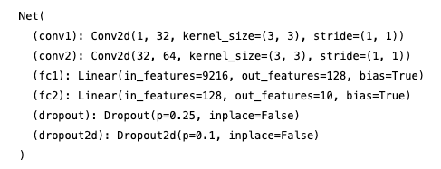
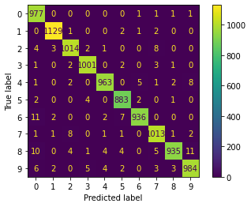

# Deep Learning & Reinforcement Learning

This repo contains notebooks on Deep Learning and Reinforcement Learning as such there are three notebooks:
- [Part 1](nndl_orkhan_bayramli_hw1.ipynb): Regression model and Feed Forward Network.
- [Part 2](nndl_orkhan_bayramli_hw2.ipynb): AutoEncoder, Denoising AutoEncoder, and Variational AutoEncoder.
- [Part 3](nndl_orkhan_bayramli_hw3.ipynb): Reinforcement Learning.

## Part 1

Part 1 contains introduction code to Deep Learning and the complexity of the projects increases by the end.

### Regression Model

The data is simple having one dependent and one indepent variable. The goal here is to demonstrate the ability to use PyTorch for Deep Learning. Below is the 2D visualization of the data:

The notebook also contains building a custom model, custom data loader, implementing a hyperparameter search with RayTune, and analyzing the weights and activations of the network. Here are some excerpts:

<ul>
    
    
</ul>

### Feed Forward Network

The dataset is MNIST hand written digits. The following images show the model architecture and the results of the network as confusion matrix.

<ul>
    
     
    
</ul>