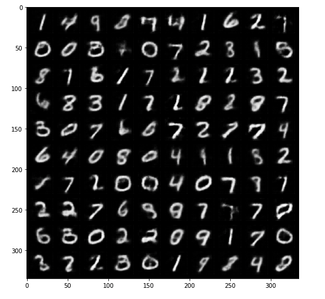

# Deep Learning & Reinforcement Learning

This repo contains notebooks on Deep Learning and Reinforcement Learning as such there are three notebooks:
- [Part 1](nndl_orkhan_bayramli_hw1.ipynb): Regression model and Feed Forward Network.
- [Part 2](nndl_orkhan_bayramli_hw2.ipynb): AutoEncoder, Denoising AutoEncoder, and Variational AutoEncoder.
- [Part 3](nndl_orkhan_bayramli_hw3.ipynb): Reinforcement Learning.

## Part 1

Part 1 contains introduction code to Deep Learning and the complexity of the projects increases by the end.

### Regression Model

The data is simple having one dependent and one indepent variable. The goal here is to demonstrate the ability to use PyTorch for Deep Learning. Below is the 2D visualization of the data:

The notebook also contains building a custom model, custom data loader, implementing a hyperparameter search with RayTune, and analyzing the weights and activations of the network. Here are some excerpts:

<ul>
    
    
</ul>

### Feed Forward Network

The dataset is MNIST hand written digits. The following images show the model architecture and the results of the network as confusion matrix.

<ul>
    
    
</ul>

## Part 2

### AutoEncoder

Autoencoder consists of two separate networks such as encoder and decoder. The same types of layers and logic have been applied to encoder and decoder. 

**Encoder** 

The encoder has three convolutional layers. The first convolutional layer has the 3x3 kernel with the stride value of 2 and padding 1. It takes 1 channel as an input and generates 8 channels as output. Then ReLU activation function is applied and after ReLU, we have the second convolutional layer.

The structure of the second convolutional layer is the same as the first one. It takes the output features of the 1st which are 8 channels and generates 16 channels. Different than the 1st Conv. Layer, batch normalization technique is applied and ReLU activation is used. Lastly, the dropout layer is attached to the output.

The third convolutional layer just takes 16 input channels and gives 32 output channels. However, padding is not applied.

After our convolutional block of the model architecture, we have the linear part. To convert a convolutional layer to the linear one, we can flatten the values of the convolutional layer into one tensor and use it as an input for the next layers. The output of the last linear layer is our encodings.

**Decoder**

The logic in the decoder part is like the mirrored form of the encoder. Almost everything is the same but in the reverse fashion.

The output of the encoder is input for the decoder. The decoder takes the encodings and tries to build the same image that has been compressed into the latent space. To the last layer of the decoder, the sigmoid activation function is applied to force the values to be between the 0 and 1 range.

Below is the overview of the AutoEncoder model architecture:

During the training K-Fold Cross Validation to prevent overfitting and RayTune for hyperparameter search have been used. I have analyzed the learned encodings by reducing their dimension to 2 to be able to plot them on the 2D graph by the help of t-SNE algorithm.

### Variational AutoEncoder

The network architecture is almost the same as the AutoEncoder however there is a difference in the encoder part. The encoder, instead of outputting encodings, now generates the means and samples for each encoding which makes it possible to sample encodings from the distribution instead of a point. The distributions should be clustered together in a meaningful way so that there is not much gap between them at the same time they are distinct from each other. In order to force this, we introduce the Kullback–Leibler divergence (KL divergence) into the loss function. The KL divergence between two probability distributions simply measures how much they diverge from each other. Minimizing the KL divergence here means optimizing the probability distribution parameters (μ and σ) to closely resemble that of the target distribution.

